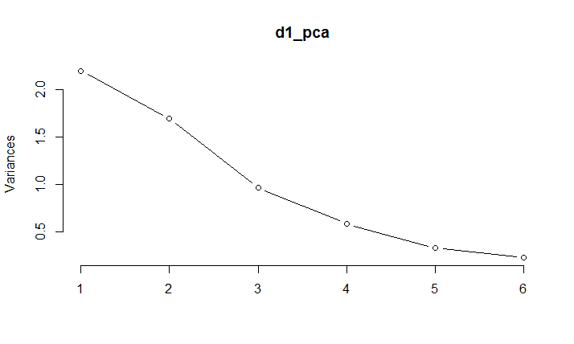

## Problem 1
$$ Given \; f(x) = x^n - na\ln x$$

$$derivative \;of \;f = f'(x) = nx^{n-1} - \frac{na}{x}$$

$$second \; derivative \;of \;f = f''(x) = n(n-1)x^{n-2} -(-1)/x^2*(na)$$

$$= n(n-1)x^{n-2} + (1/x^2)*(na)$$

but n is a non negative integer, i.e.  

$$f''(x)\geq 0$$
Therefore, f(x) is convex for any positive real number a and any non negative integer n.

To find the minimum, we have

$$f'(x) = 0 $$
so minimum of x  is at $$a^{\frac{1}{n}}$$

The R code for Newton's method to find minimum is as follows:

```{r, eval=FALSE}
myNewtonMin <- function(a, n)
{
  i = 0
  j = 0
  
  j = j+1
  while(abs(n * j^(n-1) - n*a/j) > 0.001) 
  {
    new_j = j - (n * j^(n-1) - n*a/j) / (n*(n-1)*j^(n-2) + n*a/(j^2)) # gradient descent using f'/f''
    i = i + 1
    j = new_j
  }
  return(list(result = j, itr = i))
}

x = seq(0.5, 60, 1)
n = 2
a = 60
val = (x^n - (n * a * log(x)))
plot(x, val, type="l")
myNewtonMin(a, n)
```

the plot i obtained is as follows:



and the correspoding output from the newton's method is as follows (it took about 6 iterations and min is ~8):

```{r, eval=FALSE}
$result
[1] 7.745966

$itr
[1] 6

```


## Problem 2
A is a nXn symmetric matrix.

Given that $v^*Av != 0, for\;all\;v!=0$

{u1, u2, ..., u_n is the basis of R^n}

and 

$$v_1=u_1$$

$$v_2 = u_2 - \frac{u_2^tAv_1}{v_1^tAv_1}v_1$$

$$v_2^tAv_1 = (u_2 - \frac{u_2^tAv_1}{v_1^tAv_1}v_1)^tA v_1 = u_2^tA v_1 - \frac{u_2^tAv_1}{v_1^tAv_1} v_1^tAv_1 = 0$$
which means v_1,v_2 are conjugate. We can use similar trick to prove that $v_1, \ldots, v_n$ are conjugate - as shown below

Now, suppose if $v_k$  is conjugate with $v_1,\ldots, v_{k-1} $, then we have

$$v_{k+1} = u_{k+1}^t -\sum_{j=1}^{k}\frac{u_{k+1}^tAv_j}{v_j^tAv_j}v_j$$

$$\text{for }i=1,\ldots,k,  $$

$$v_{k+1}^tAv_i = (u_{k+1}^t -\sum_{j=1}^{k}\frac{u_{k+1}^tAv_j}{v_j^tAv_j}v_j)^tAv_i$$

$$= u_{k+1}^tAv_i - \sum_{j=1}^{k}\frac{u_{k+1}^tAv_j}{v_j^tAv_j}v_j^tAv_i$$

As $v_j^tAv_i = 0$ for i != j, we have  

$$= u_{k+1}^tAv_i  - \frac{u_{k+1}^tAv_i}{v_i^tAv_i}v_i^tAv_i$$

$$=0$$

$$\text{This implies that } v_1, \ldots, v_n\ \text{ are conjugate.} $$

Moreover, they also provide basis because: lets say $v_n$ is the combination of $v_1$, ... , $v_{n-1} $, then there exist i, such that $v_n^tAv_i$  != 0 which is against our input assumptions.


## Problem 3

The R code for computing conjugate gradient and BFGS is as follows:

```{r, eval=FALSE}
myConjugateGradient<-function(M1, M2, x, x2)
{
  itr = 0
  v = M2 + M1 %*% x
  
  for(i in 1:nrow(M1))
  {
    #rval1 = v / (t(v) %*% M1 %*% v)
    lval1 = -t(M1 %*% x + M2)
    t = as.numeric(lval1 %*% v / (t(v) %*% M1 %*% v))
    
    itr = itr + 1
    j = t*v
    x = x + j
    #rval1 = v / (t(v) %*% M1 %*% v)
    lval1 = t(M1 %*% x + M2)
    alpha = as.numeric(lval1 %*% M1 %*% v / (t(v) %*% M1 %*% v))
    v = alpha * v - (M1 %*% x + M2)
  }
}

myBFGS <- function(M1, M2, H, x, x2)
{
  x2 = matrix(c(0,0))
  itr = 0
  for(i in 1:nrow(M1))
  {
    itr = itr + 1
    
    kk = M1 %*% x + M2
    v = -solve(H, kk)
    
    lval2 = t(M1 %*% x + M2)
    t = -as.numeric(lval2 %*% v / (t(v) %*% M1 %*% v))
    
    new_x = x
    j = t*v
    new_x = new_x + j
    s = j
    diffVal = new_x - x
    y = M1 %*% diffVal
    
    lval3 = as.numeric(t(y) %*% s)
    H = H + y %*% t(y) / lval3 - H %*% s %*% t(s) %*% H /
      as.numeric(t(s) %*% H %*% s)
    
    x = new_x
  }
}

H = diag(2)
InitVal=matrix(c(0,0))
InitVal2=matrix(c(0,0))
M1 = matrix(c(2,1,1,1),nrow=2)
M2 = matrix(c(1,1))

myBFGS(M1, M2, H, InitVal, InitVal2)
myConjugateGradient(M1, M2, InitVal, InitVal2)
```

After executing myConjugateGradient module, the output is as follows:

```{r, eval=FALSE}
$itr
[1] 1

$v
     [,1]
[1,]    1
[2,]    1

$x
     [,1]
[1,] -0.4
[2,] -0.4

$itr
[1] 2

$v
      [,1]
[1,]  0.16
[2,] -0.24

$x
              [,1]
[1,]  5.551115e-17
[2,] -1.000000e+00
```

After executing myBFGS module, the output is as follows:

```{r, eval=FALSE}
$itr
[1] 1

$v
     [,1]
[1,]   -1
[2,]   -1

$x
     [,1]
[1,] -0.4
[2,] -0.4

$H
     [,1] [,2]
[1,]  2.3  0.7
[2,]  0.7  1.3

$itr
[1] 2

$v
      [,1]
[1,]  0.16
[2,] -0.24

$x
              [,1]
[1,]  1.665335e-16
[2,] -1.000000e+00

$H
     [,1] [,2]
[1,]    2    1
[2,]    1    1
```

As expected, the two sequences of iterates coincide. To find the optimum, we can use the R module optim. Running optim by passing CG as parameter, the output is as follows:

```{r, eval=FALSE}
$par
              [,1]
[1,]  9.939219e-07
[2,] -1.000003e+00

$value
[1] -0.5

$counts
function gradient 
      55       27 

$convergence
[1] 0

$message
NULL
```

Similarly, the output of optim for BFGS is as follows:
```{r, eval=FALSE}
$par
              [,1]
[1,] -3.798632e-07
[2,] -9.999994e-01

$value
[1] -0.5

$counts
function gradient 
      16       10 

$convergence
[1] 0

$message
NULL
```